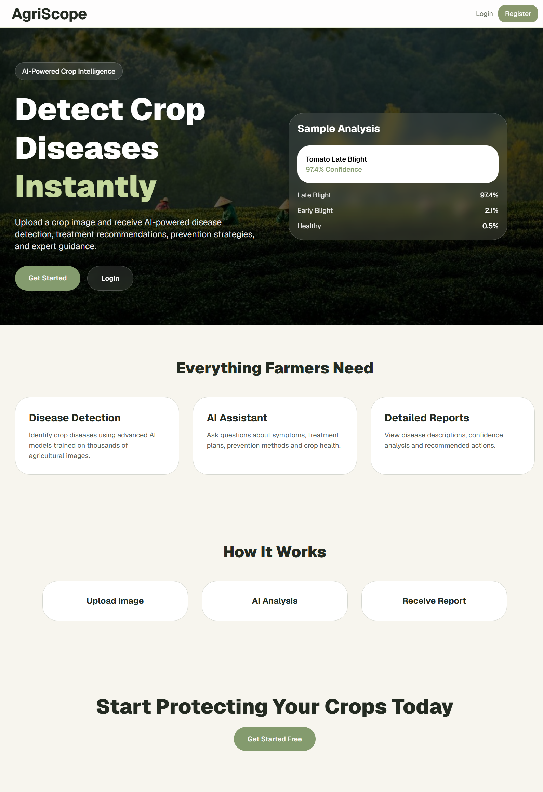
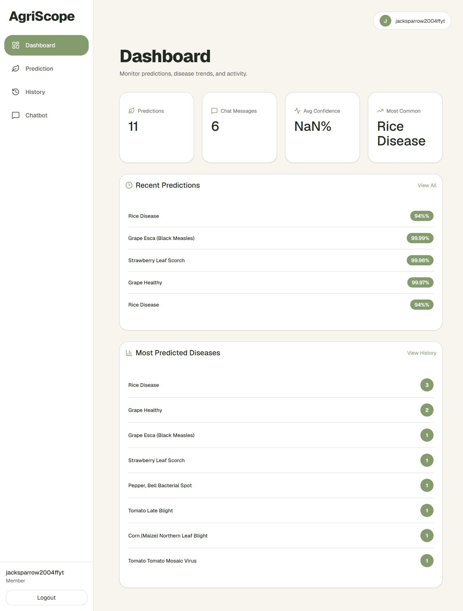
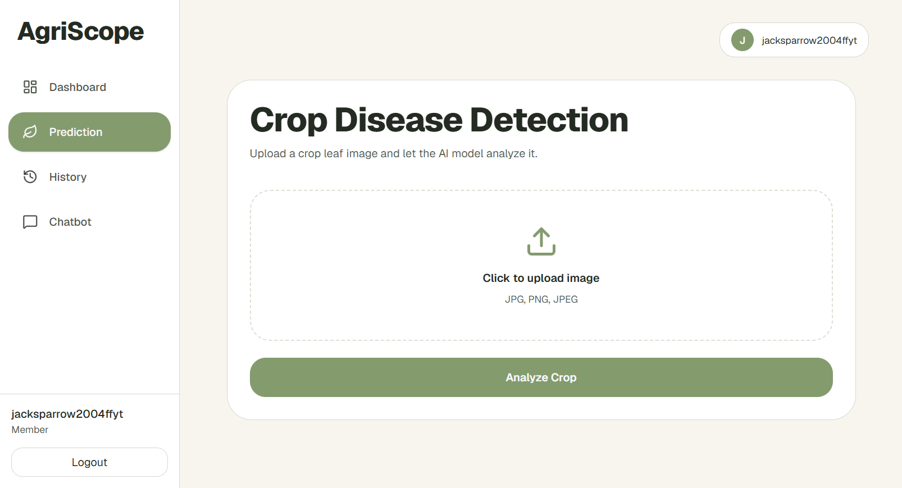
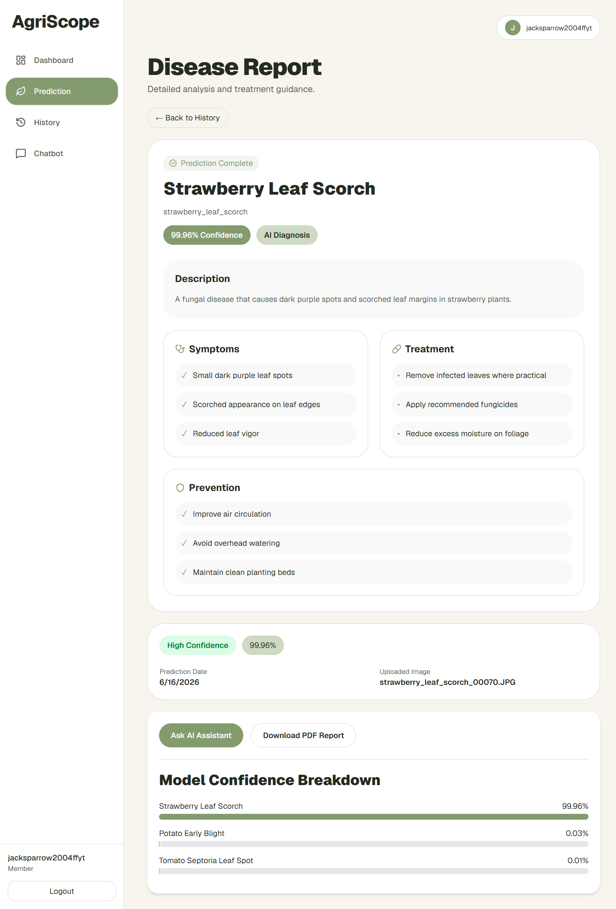
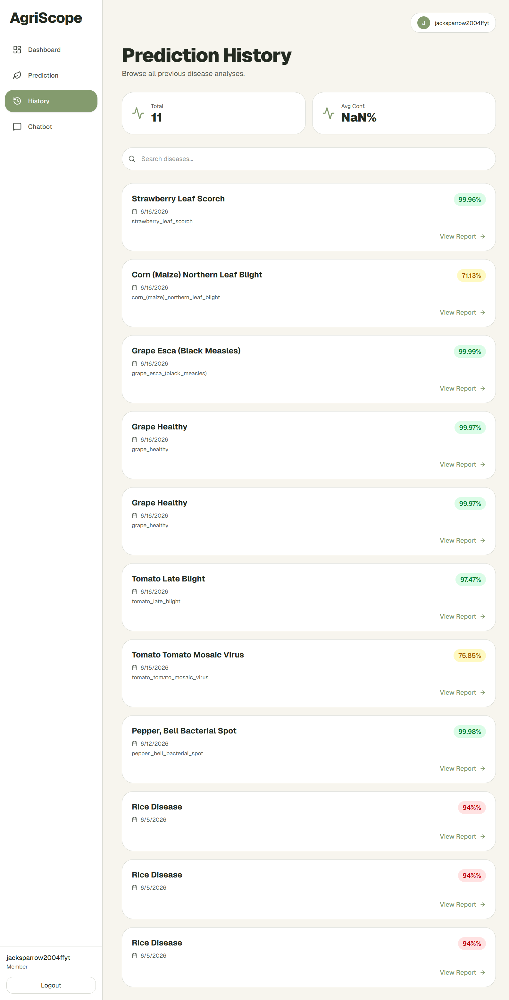
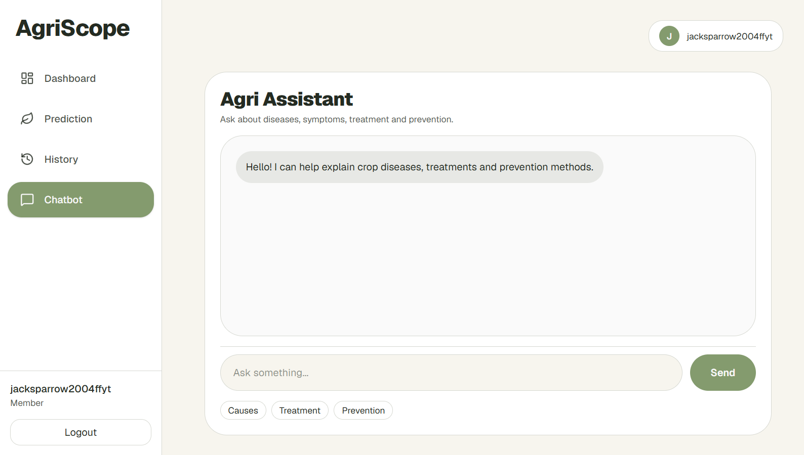

# 🌱 AgriScope

An AI-powered crop disease detection platform that helps farmers and agricultural professionals identify plant diseases from leaf images, receive treatment recommendations, and get expert guidance through an intelligent agricultural assistant.

---

## 🚀 Overview

AgriScope uses Deep Learning and Computer Vision to analyze crop leaf images and predict diseases with confidence scores. The platform provides detailed disease reports, prevention strategies, treatment recommendations, prediction history tracking, and an AI-powered chatbot for agricultural assistance.

---

## ✨ Features

### 🔍 AI Disease Detection
- Upload crop leaf images
- Instant disease prediction
- Confidence score analysis
- Top prediction breakdown

### 📋 Detailed Disease Reports
- Disease description
- Symptoms identification
- Treatment recommendations
- Prevention strategies

### 🤖 AI Agricultural Assistant
- Ask questions about diseases
- Learn treatment methods
- Get prevention guidance
- Agricultural knowledge support

### 📊 Dashboard Analytics
- Total predictions
- Chat activity tracking
- Average confidence metrics
- Most common disease insights

### 📚 Prediction History
- View previous analyses
- Search prediction records
- Access detailed reports
- Track crop health over time

### 🔐 Authentication
- User registration
- Secure login
- Firebase Authentication
- Protected routes

---

## 🛠️ Tech Stack

### Frontend
- React.js
- Vite
- Tailwind CSS
- React Router DOM
- Lucide React Icons

### Backend
- FastAPI
- Python
- TensorFlow / Keras
- Pillow
- NumPy

### Database & Authentication
- Firebase Firestore
- Firebase Authentication

### Machine Learning
- Convolutional Neural Network (CNN)
- TensorFlow
- Plant Disease Classification Model

---

## 📸 Screenshots

### Home Page


### Dashboard


### Disease Prediction


### Disease Report


### Prediction History


### AI Assistant


---

## 📂 Project Structure

```text
AgriScope
│
├── frontend
│   ├── src
│   ├── public
│   ├── package.json
│   └── ...
│
├── backend
│   ├── app.py
│   ├── models
│   ├── data
│   ├── requirements.txt
│   └── ...
│
├── screenshots
│   ├── home.png
│   ├── dashboard.png
│   ├── prediction.png
│   ├── report.png
│   ├── history.png
│   └── chatbot.png
│
├── README.md
├── LICENSE
└── .gitignore
```

---

## ⚙️ Installation

### Clone Repository

```bash
git clone https://github.com/yourusername/agriscope.git

cd agriscope
```

---

## Frontend Setup

```bash
cd frontend

npm install

npm run dev
```

Frontend will run on:

```text
http://localhost:5173
```

---

## Backend Setup

```bash
cd backend

pip install -r requirements.txt

uvicorn app:app --reload
```

Backend will run on:

```text
http://127.0.0.1:8000
```

---

## 🔑 Environment Variables

### Frontend (.env)

```env
VITE_FIREBASE_API_KEY=
VITE_FIREBASE_AUTH_DOMAIN=
VITE_FIREBASE_PROJECT_ID=
VITE_FIREBASE_STORAGE_BUCKET=
VITE_FIREBASE_MESSAGING_SENDER_ID=
VITE_FIREBASE_APP_ID=
```

### Backend (.env)

```env
OPENAI_API_KEY=
```

---

## 🧠 Machine Learning Workflow

1. User uploads a crop leaf image.
2. Image is sent to the FastAPI backend.
3. TensorFlow model processes the image.
4. Disease predictions are generated.
5. Confidence scores are calculated.
6. Results are returned to the frontend.
7. Prediction is stored in Firebase.
8. Detailed disease information is displayed.

---

## 🌾 Supported Crops

- Apple
- Corn (Maize)
- Grape
- Potato
- Pepper
- Tomato
- Strawberry
- Peach
- Orange
- Soybean
- Raspberry
- Squash
- Cherry
- Blueberry

---

## 📊 Core Modules

### Dashboard
Provides an overview of user activity and prediction statistics.

### Prediction
Analyzes uploaded crop images and identifies diseases.

### History
Stores and displays previous disease analyses.

### Disease Reports
Displays symptoms, treatment methods, and prevention strategies.

### AI Assistant
Provides agricultural guidance through conversational interaction.

---

## 🎯 Future Enhancements

- Mobile Application
- Multi-language Support
- Real-time Camera Detection
- Weather-Based Disease Alerts
- Crop Recommendation System
- Disease Severity Estimation
- Offline Prediction Support

---

## 🤝 Contributing

Contributions are welcome.

1. Fork the repository
2. Create a feature branch

```bash
git checkout -b feature-name
```

3. Commit changes

```bash
git commit -m "Added feature"
```

4. Push changes

```bash
git push origin feature-name
```

5. Open a Pull Request

---

## 📄 License

This project is licensed under the MIT License.

---

## 👨‍💻 Author

**Your Name**

Final Year B.Tech Computer Science Student

Passionate about Artificial Intelligence, Machine Learning, and Full-Stack Development.

---

## ⭐ Support

If you found this project useful, consider giving it a star on GitHub.
